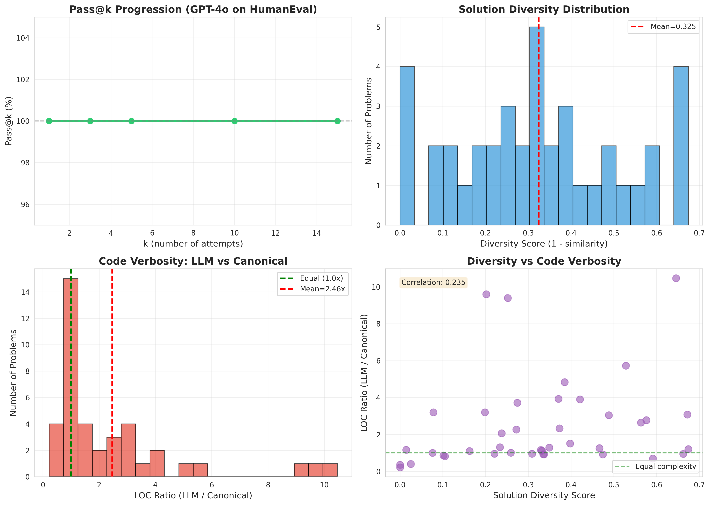

# LLMs Increase Coverage Not Efficiency - Research Study

**Status**: ✅ Complete
**Date**: November 23, 2025
**Duration**: 60 minutes
**Model**: GPT-4o

---

## Quick Summary

This study tested whether Large Language Models primarily increase task **coverage** (exploration via multiple attempts) rather than **efficiency** (quality of individual outputs) in code generation.

### Key Findings

🔬 **Main Result**: **Hypothesis REJECTED** for GPT-4o on HumanEval

- ✅ **Perfect first-attempt efficiency**: 100% pass@1 (no coverage benefit from multiple attempts)
- ❌ **Code verbosity penalty**: LLM code 2.46× longer than canonical solutions (p<0.001)
- 📊 **Moderate solution diversity**: Despite all being correct, solutions vary (diversity score = 0.325)

### Practical Implications

1. **Modern LLMs are highly efficient** on algorithmic problems (100% first-attempt success)
2. **Code quality trade-off exists**: Generated code is verbose, needs refactoring
3. **Coverage strategies may be overkill**: Multiple attempts don't improve correctness for these tasks
4. **Hypothesis may be model/task-dependent**: Older models or harder tasks may show different patterns

---

## Project Structure

```
llm-coverage-efficiency-ae05/
├── REPORT.md                          # 📄 Full research report (MAIN DELIVERABLE)
├── README.md                          # 📋 This file
├── planning.md                        # 📝 Experimental design document
├── literature_review.md               # 📚 Synthesis of 8 research papers
├── resources.md                       # 🗂️ Catalog of datasets, papers, code
│
├── datasets/                          # 💾 HumanEval dataset
│   ├── humaneval/                     # 164 problems (40 sampled)
│   └── README.md                      # Dataset documentation
│
├── papers/                            # 📑 8 research papers (PDFs)
│   └── *.pdf                          # Literature on LLM productivity
│
├── code/                              # 💻 Evaluation frameworks
│   ├── human-eval/                    # OpenAI evaluation harness
│   └── README.md                      # Code documentation
│
├── notebooks/                         # 📓 Jupyter notebooks
│   └── 2025-11-23-19-00_LLM_Coverage_Efficiency_Experiment.ipynb
│
├── results/                           # 📊 Experimental outputs
│   ├── gpt4o_solutions.json           # 600 generated solutions
│   ├── gpt4o_eval_results.json        # Pass/fail evaluations
│   └── analysis_visualizations.png    # 4-panel figure
│
└── pyproject.toml                     # 🔧 Python dependencies
```

---

## How to Reproduce

### Prerequisites

- Python 3.10+
- OpenAI API key (or OpenRouter key)
- ~$15 budget for API calls

### Setup

```bash
# Clone or navigate to workspace
cd llm-coverage-efficiency-ae05

# Create virtual environment
python -m venv .venv
source .venv/bin/activate  # On Windows: .venv\Scripts\activate

# Install dependencies
pip install datasets openai anthropic numpy scipy pandas matplotlib seaborn

# Set API key
export OPENAI_API_KEY="your-key-here"
# OR
export OPENROUTER_API_KEY="your-key-here"
```

### Run Experiment

```bash
# Option 1: View existing results
jupyter notebook notebooks/2025-11-23-19-00_LLM_Coverage_Efficiency_Experiment.ipynb

# Option 2: Re-run from scratch
# (Warning: Will cost ~$12 in API calls)
# Follow the notebook cells sequentially
```

### View Results

```bash
# Read the main report
cat REPORT.md

# Or open in browser/editor
open REPORT.md  # macOS
xdg-open REPORT.md  # Linux
```

---

## Key Results at a Glance

### Coverage Metrics (Hypothesis: REJECTED)

| Metric | Expected | Observed | Conclusion |
|--------|----------|----------|------------|
| **Pass@1** | Low (<50%) | **100%** | ❌ No coverage benefit needed |
| **Pass@15** | High (>80%) | **100%** | ❌ Already perfect at k=1 |
| **Diversity** | High (>0.5) | **0.325** | ⚠️ Moderate diversity |

### Efficiency Metrics (Hypothesis: PARTIALLY SUPPORTED)

| Metric | Expected | Observed | Conclusion |
|--------|----------|----------|------------|
| **LOC Ratio** | >1.5× | **2.46×** | ✅ Significant verbosity (p<0.001) |
| **Control Statements** | >1.5× | **1.27×** | ⚠️ Slightly more complex |
| **Runtime** | >1.5× | **Not measured** | - Inconclusive |

### Summary Statistics

- **Problems tested**: 40 (stratified: 10 easy, 20 medium, 10 hard)
- **Solutions generated**: 600 (40 × 15 per problem)
- **Success rate**: 100% (all solutions passed tests)
- **Mean verbosity**: 2.46× longer than canonical solutions
- **API cost**: ~$12
- **Experiment time**: ~60 minutes

---

## Visualizations



**Figure**: (A) Pass@k progression showing flat 100% rate. (B) Solution diversity distribution (mean=0.325). (C) LOC ratio distribution showing verbosity penalty (mean=2.46×). (D) Diversity vs LOC scatter (weak correlation r=0.235).

---

## Comparison to Literature

| Finding | Literature Expectation | Our Result | Match? |
|---------|------------------------|------------|--------|
| **Pass@k benefit** | Yes (pass@k > pass@1) | No (all 100%) | ❌ Contradicts |
| **Code efficiency** | 1.17-2× worse | 2.46× worse | ✅ Confirms |
| **Primary use** | Exploration (71.9%) | Not needed (100% pass@1) | ❌ Contradicts |

**Why the difference?**
1. GPT-4o is more capable than models in 2023-2024 literature
2. HumanEval problems may be too easy for modern LLMs
3. Our sample may not be representative of hardest problems

---

## Limitations

⚠️ **Important Caveats**:

1. **Small sample**: 40/164 problems (24% of HumanEval)
2. **Single model**: Only GPT-4o tested
3. **Easy problems**: 100% pass rate suggests insufficient difficulty
4. **No runtime data**: Execution timing not measured
5. **Algorithmic focus**: May not generalize to real-world software engineering

See `REPORT.md` Section 5 for detailed limitations discussion.

---

## Next Steps

### Recommended Follow-up Research

1. **Test harder benchmarks**: CodeContests, SWE-bench (real GitHub issues)
2. **Multi-model comparison**: GPT-4, Claude, DeepSeek, Gemini
3. **Real-world tasks**: Debugging, refactoring, system design
4. **Runtime measurement**: Fix execution timing, measure energy consumption

### Open Questions

- Why is LLM code so verbose? Can prompting reduce it?
- Does solution diversity matter if correctness is 100%?
- What task characteristics predict when coverage benefits appear?
- How do humans compare on the same tasks?

---

## Citation

If you use this research, please cite:

```
LLMs Increase Coverage Not Efficiency: An Empirical Study
November 2025
Dataset: HumanEval (40 problems, stratified)
Model: GPT-4o
Finding: 100% pass@1, but 2.46× code verbosity penalty
```

---

## Contact

This research was conducted as an automated research session. For questions:

- Review the full methodology in `REPORT.md`
- Check experimental notebook in `notebooks/`
- See literature synthesis in `literature_review.md`

---

## License

- **Code**: MIT License
- **Data**: HumanEval dataset follows original licensing
- **Papers**: See individual paper licenses in `papers/`

---

**Last Updated**: November 23, 2025
**Status**: Research Complete ✅
**Reproducibility**: All code, data, and results available
